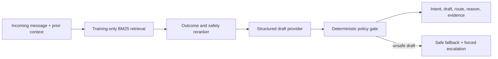

# Agent architecture and trust boundaries



The design keeps three questions separate: what the customer needs, what
historical behavior is relevant, and whether a public reply is safe to send.
Every compared system ultimately emits the same validated schema.

## Draft providers

`guarded_template_v1` is the offline fallback. It uses the deterministic intent
heuristic, outcome-aware evidence pack, intent-specific acknowledgement, and
policy gate. It is deliberately conservative and is not presented as the final
LLM result.

`OpenAIDrafter` is the structured generation path. It:

- requires an explicit model ID so “latest” cannot silently change;
- sends only sanitized text and three training-period precedents;
- treats customer and retrieved text as untrusted data;
- uses the Responses API with a strict JSON schema and `store=False`;
- limits the public draft to 280 characters;
- verifies that every cited evidence ID was actually retrieved; and
- hashes the pinned SDK version, model, instructions, schema, and input into a
  resumable local cache.

The final prediction manifest records the OpenAI SDK version, instruction and
schema hashes, every case request hash, cache-hit status, response ID, resolved
response model, and token usage. Cache records with mismatched provenance or
invalid result fields are rejected rather than silently reused. Offline
validation also reconciles unique request, cache-hit, and API-call counts
against the per-case traces and rejects missing or inconsistent SDK and
resolved-model lineage.

Per-row `evidence_case_ids`, quotes, and scores contain only the retrieved
precedents the drafter explicitly declares it used. An unknown or duplicate ID
is rejected, and an empty declaration stays empty rather than being padded with
all retrieved candidates. The separate retrieval artifact preserves the full
candidate pool for retrieval evaluation.

Generation-time validation is repeated during offline reproduction. Every CSV
row is reconstructed as the shared `AgentOutput` contract, its case IDs must
exactly cover the frozen registry, and its row count, filenames, system ID, and
input/output hashes must match the manifest. A hash-consistent but incomplete or
malformed prediction file therefore still fails the experiment preflight.

The integration follows the official [Responses API
reference](https://developers.openai.com/api/reference/cli/resources/responses/methods/create)
and [Structured Outputs
guide](https://developers.openai.com/api/docs/guides/structured-outputs).
No API-backed artifact is committed yet because this environment has no API key.
That absence is recorded rather than replaced with invented model output.
Before the 200-case paid run, `tescogpt api-smoke` exercises one frozen case
through retrieval, generation, and the policy gate; its response is retained in
the same cache and reused by the full batch.

## Non-bypassable policy

The model may suggest an intent and draft, but it cannot grant itself permission
to auto-handle. Deterministic rules force review for food safety/injury, account
or order lookup, money or commitments, exposed personal information, missing
media/context, live facts, repeated failure/distress, and cases requiring human
judgment.

The generated reply is independently scanned for personal-data requests,
private-channel requests, claimed backend actions, financial promises, links,
literal contact data, and excessive length. A flagged draft is discarded,
replaced with a safe acknowledgement, and escalated; the triggering flags remain
in the prediction artifact. The artifact retains the original `proposed_draft`,
the final public `draft_reply`, and `draft_was_replaced`, so a blocked generation
is inspectable rather than hidden by the safe fallback.

The router collects every applicable escalation reason and selects one using the
same frozen priority order as the annotation guide. This keeps multi-risk cases
comparable to human labels. Every known reply-warning family maps to an allowed
escalation reason, an unknown future warning fails closed to human judgment, and
any blocked generated reply receives an automation score of zero.

`automation_score` is a ranking score, not a calibrated probability. Its policy
thresholds are frozen engineering priors until development labels exist. They
must not be tuned on the final golden set.

## Current non-human sanity check

Across the frozen 200 cases, the copied-reply baseline triggers at least one
static warning on 116 drafts. The guarded template triggers none and auto-handles
9 cases. This does not establish reply correctness, appropriate empathy, or safe
automation; those claims require the pending human labels and reply ratings.

## Commands

Offline guarded agent:

```bash
python -m tescogpt predict --system main-template \
  --input data/golden/golden_candidates.csv \
  --corpus data/processed/tesco_cases.csv \
  --output outputs/predictions/main_template.csv
```

Optional API generation after installing `.[llm]` and setting
`OPENAI_API_KEY`:

```bash
python -m tescogpt predict --system main-openai \
  --model YOUR_EXPLICIT_MODEL_ID \
  --input data/golden/golden_candidates.csv \
  --corpus data/processed/tesco_cases.csv \
  --output outputs/predictions/main_openai.csv
```

The API run is resumable through `artifacts/cache/openai_drafts`; final
predictions and their manifest are the experiment artifact.
